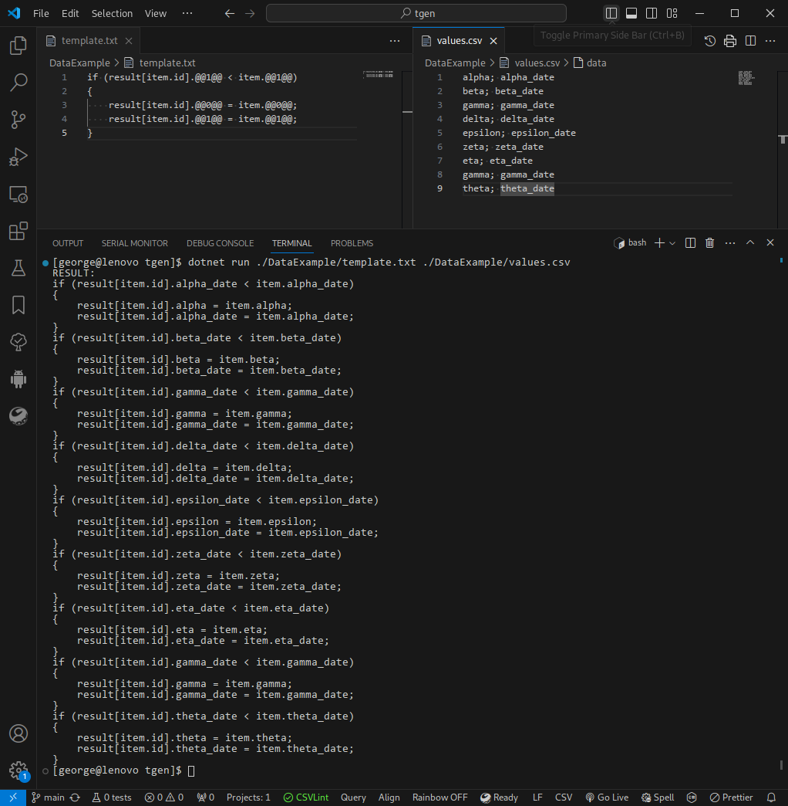

# Tgen
Простой генератор по шаблону

## Входные данные

В качестве входных данных принимаются текст шаблона и параметры для подстановки.
Для указания параметра в исходном тексте шаблона используется обозначение `@@N@@`, где `N` является номером параметра.
Нумерация параметров начинается с 0.

## Выходные данные

В обычном режиме результат выводится на консоль.
При этом любые сообщения системы логирования подавляются.

Если же в аргументах командной строки указан выходной файл - запись будет произведена в него.
В случае если файл существует - он будет перезаписан.
Директория, указанная в пути выходного файла, должна существовать.

## Пример использования

Шаблон
```
if (result[item.id].@@1@@ < item.@@1@@)
{
    result[item.id].@@0@@ = item.@@0@@;
    result[item.id].@@1@@ = item.@@1@@;
}

```

Параметры шаблона (csv)
```
alpha; alpha_date
beta; beta_date
gamma; gamma_date
delta; delta_date
epsilon; epsilon_date
zeta; zeta_date
eta; eta_date
gamma; gamma_date
theta; theta_date
```

Результат
```
if (result[item.id].alpha_date < item.alpha_date)
{
    result[item.id].alpha = item.alpha;
    result[item.id].alpha_date = item.alpha_date;
}

if (result[item.id].beta_date < item.beta_date)
{
    result[item.id].beta = item.beta;
    result[item.id].beta_date = item.beta_date;
}

if (result[item.id].gamma_date < item.gamma_date)
{
    result[item.id].gamma = item.gamma;
    result[item.id].gamma_date = item.gamma_date;
}

if (result[item.id].delta_date < item.delta_date)
{
    result[item.id].delta = item.delta;
    result[item.id].delta_date = item.delta_date;
}

if (result[item.id].epsilon_date < item.epsilon_date)
{
    result[item.id].epsilon = item.epsilon;
    result[item.id].epsilon_date = item.epsilon_date;
}

if (result[item.id].zeta_date < item.zeta_date)
{
    result[item.id].zeta = item.zeta;
    result[item.id].zeta_date = item.zeta_date;
}

if (result[item.id].eta_date < item.eta_date)
{
    result[item.id].eta = item.eta;
    result[item.id].eta_date = item.eta_date;
}

if (result[item.id].gamma_date < item.gamma_date)
{
    result[item.id].gamma = item.gamma;
    result[item.id].gamma_date = item.gamma_date;
}

if (result[item.id].theta_date < item.theta_date)
{
    result[item.id].theta = item.theta;
    result[item.id].theta_date = item.theta_date;
}

```

Пример использования инструмента представлен на изображении ниже


